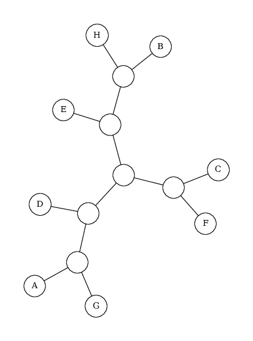
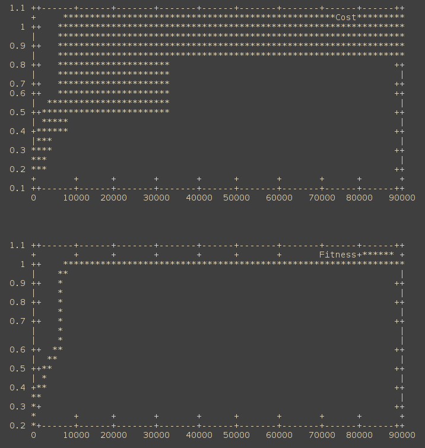

</img>

# ncd-mqtc
Toolbench for working with Normalized Compression Distance (NCD) and the Minimum Quartet Tree Cost (MQTC) clustering algorithm.

## How do I use it?
Assemble a corpus in a directory, and use the `ncd` tool to generate an NCD datafile containing a similarity matrix for the corpus and a key to make it easier to tag the matrix elements with their filenames during subsequent processing.

Once you have the NCD data file, input it to the `mqtc` tool, along with a number of generations, and it will perform MQTC clustering and output its answer.

Note that MQTC is a Markov-chain Monte Carlo genetic algorithm.

## Which compressor to use?
The NCD is a family of similarity metrics, so you must specify a suitable data compressor to use. Each has benefits and tradeoffs. For a full explanation, see <paper link>.

## Walkthrough

Make everything:

        make all

Make just the `compress` program:

        make compress

Make just the `cluster` program:

        make cluster

Instructions for `compress`:

        Run `./ncd` for usage.

Instructions for `cluster`:

        ./mqtc < 1000 _data/10x10.txt
        
</img>

## Example `ncd` datafile:

        WORKING PATH: testdata/.ncd/
        FILE_COUNT:13, NCD_COUNT:13
        KEY>>>
        0 : corvus-splendens.fasta
        1 : garrulus-glandarius.fasta
        2 : homo-neanderthalensis.fasta
        3 : homo-sp.altai.fasta
        4 : corvus-cornix-cornix.fasta
        5 : corvus-brachyrhynchos.fasta
        6 : podiceps-cristatus.fasta
        7 : homo-heidelbergensis.fasta
        8 : urocissa-erythrorhyncha.fasta
        9 : corvus-macrorhynchos.fasta
        10: corvus-frugilegus.fasta
        11: podoces-hendersoni.fasta
        12: homo-sapiens.fasta
        <<<KEY
        NCD>>>
           0                    1                    2                    3                    4                    5                    6                    7                    8                    9                    10                   11                   12
        0  0                    0.67697              0.794711             0.795783             0.605503             0.543327             0.780418             0.796319             0.676434             -0.00428801          0.762194             0.752903             0.710023
        1  0.67697              0                    0.792511             0.792511             0.695205             0.68144              0.774783             0.792873             0.790996             0.775937             -0.0131059           0.407314             0.804269
        2  0.794711             0.792511             0                    0.437947             0.793439             0.793197             0.788634             0.430109             0.797324             0.78116              0.421005             -0.00788813          0.806233
        3  0.795783             0.792511             0.437947             0                    0.792718             0.792292             0.7871               0.393248             0.637498             0.715778             0.798205             0.788455             0.0253188
        4  0.605503             0.695205             0.793439             0.792718             0                    0.511355             0.775775             0.7938               0.547404             0.674712             0.770377             0.760488             0.532264
        5  0.543327             0.68144              0.793197             0.792292             0.511355             0                    0.776551             0.793378             0.747243             0.729107             0.730162             0.721406             0.757192
        6  0.780418             0.774783             0.788634             0.7871               0.775775             0.776551             0                    0.789781             0.839812             0.823307             0.452424             0.407673             0.848642
        7  0.796319             0.792873             0.430109             0.393248             0.7938               0.793378             0.789781             0                    0.711987             0.696866             0.782765             0.773575             0.733577
        8  0.694479             0.690833             0.792804             0.792623             0.702956             0.689387             0.775267             0.793166             0.432833             0.672731             0.777917             0.768555             0.635509
        9  0.423977             0.673271             0.794128             0.793768             0.608429             0.535303             0.776837             0.794308             0.608429             0.681196             0.775943             0.767659             0.652378
        10 0.59657              0.683303             0.793357             0.794075             0.625673             0.58061              0.778456             0.794973             0.697307             0.685099             0.774147             0.766045             0.736266
        11 0.685546             0.688419             0.793654             0.79455              0.710649             0.6981               0.77716              0.795267             0.776622             0.75995              0.336501             0.371639             0.788992
        12 0.795426             0.79233              0.373236             0.413972             0.793259             0.792292             0.786731             0.376095             0.792804             0.793228             0.793896             0.794729             0
        <<<NCD
